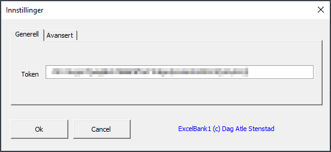
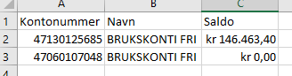
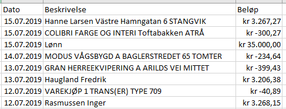

## ExcelBank1; Excel Add-in for SpareBank 1 API

ExcelBank1 er en Excel Add-in som gir deg tilgang til dine bankkontoer fra **SpareBank 1** direkte i Excel.

# Installasjon
1. Last ned siste [versjon av ExcelBank1](https://bitbucket.org/Stenstad/excelbank1/downloads/).
2. Pakk ut zip-filen. 
3. Legg til ExcelBank1 som ny [Add-in i Excel](https://support.office.com/en-us/article/add-or-remove-add-ins-in-excel-0af570c4-5cf3-4fa9-9b88-403625a0b460).
4. For å kunne ta i bruk ExcelBank1 må du registerer deg som bruker på [https://www.sparebank1.no/nb/bank/bedrift/open-api/gettingstarted.html](https://www.sparebank1.no/nb/bank/bedrift/open-api/gettingstarted.html). Her kan man opprettet token (nøkkel) som ExcelBank1 trenger for å kunne identifisere deg. 
5. Start Excel og skriv følgende formel i en valgfri celle: **=SB1Innstillinger()**
6. Legg inn din token fra punkt 4 og trykk <Ok>. 

#  Bruk/ formler
Etterhvert som du skriver formler vil Excel komme med forslag. I forslagslisten kan du navigere deg med piltastene og trykke <Tab> for å autoutfylle og <Tab> igjen for å velge. 

**=SB1Innstillinger()** åpner skjembilde hvor man kan legge inn token (nøkkel). Man kan legge inn produksjons-token (dine reele bank kontoer) og/eller utvikler-token (leke bankkontoer for test/utvikling). 

**=SB1hentAllePeronligeKontoer()** henter alle tilgjengelige kontoer med tilhørende saldo. 

**=SB1hentAllePeronligeTransaksjoner(*konto*)** henter alle transaksjoner fra valgt konto. 

